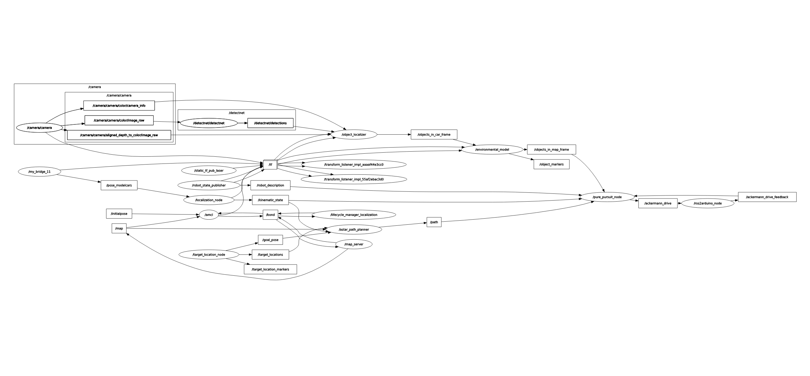

# Pure Pursuit Path Tracking Controller

ROS 2 **Path Tracking Controller** for Team CUROBOT.

**Main Contributor**  
Raidhu Beiucy Duraisamy

## Table of Contents
- [Component Description](#component-description)
- [Current Node Behavior](#current-node-behavior)
- [Topics and Message Types](#topics-and-message-types)
- [Frames](#frames)
- [User Story](#user-story)
- [Acceptance Criteria](#acceptance-criteria)
- [Installation](#installation)
- [Build and Source](#build-and-source)
- [How to Run](#how-to-run)
- [Launch File Usage](#launch-file-usage)
- [RQT and RViz2](#rqt-and-rviz2)
- [Expected Output](#expected-output)
- [Notes and Limitations](#notes-and-limitations)

---

## Component Description

The **Pure Pursuit Path Tracking Controller** implements a geometric path tracking algorithm that computes steering commands to make the vehicle follow a reference path while performing real-time obstacle avoidance.

The current implementation is a ROS 2 node named `pure_pursuit_node` that:
- Subscribes to a **reference path** from the path planner
- Subscribes to the **kinematic state** (pose and velocity) of the robot
- Subscribes to **detected obstacles** in the map frame
- Receives **safety signals** (`allowed_to_move`, `traffic_decision`) for emergency stops
- Computes steering angle using the pure pursuit geometric algorithm with dynamic look-ahead
- Applies obstacle detection and collision avoidance logic
- Publishes **Ackermann steering commands** (`steering_angle`, `speed`, `acceleration`)
- Publishes **obstacle detection status** for downstream safety modules
- Operates at 100 Hz (10 ms sampling)

---

## Current Node Behavior

The node performs the following pipeline:

1. Receive `Path` message with reference waypoints from path planner.
2. Read latest `KinematicState` to get current robot pose and velocity.
3. Validate safety conditions: check `allowed_to_move` and `traffic_decision` signals.
4. Subscribe to `/objects_in_map_frame` for detected obstacles.
5. Compute distance to goal waypoint: $d_{goal} = \sqrt{(x_{goal} - x)^2 + (y_{goal} - y)^2}$
6. If $d_{goal} \leq 0.3$ m (goal tolerance), publish stop command.
7. If obstacle detected within distance threshold, publish stop command.
8. If external stop signal received, publish stop command.
9. Otherwise, compute steering angle using pure pursuit algorithm:
   - Calculate dynamic look-ahead distance: $L_f = k \cdot |v| + L_d$
   - Find the look-ahead point on the reference path
   - Compute cross-track error angle
   - Apply steering control law with limits $[-30°, 30°]$
10. Publish `AckermannDrive` command with steering angle and speed.
11. Publish `obstacle_information` (Bool) indicating current obstacle status.
12. If obstacles go stale (no detections for timeout duration), automatically resume motion.

---

## Topics and Message Types

| Topic Name | Message Type | Direction | Connected Component | Description |
|---|---|---|---|---|
| `/path` | `nav_msgs/msg/Path` | Input (Subscribe) | Path Planner -> Controller | Reference waypoints to follow |
| `/kinematic_state` | `curobot_msgs/msg/KinematicState` | Input (Subscribe) | Localization -> Controller | Current robot pose, orientation, velocity |
| `/objects_in_map_frame` | `vision_msgs/msg/Detection3DArray` | Input (Subscribe) | Object Localizer -> Controller | Detected obstacles with 3D bounding boxes in map frame |
| `/allowed_to_move` | `std_msgs/msg/Bool` | Input (Subscribe) | Safety Module -> Controller | Safety signal (False=STOP, True=MOVE) |
| `/traffic_decision` | `std_msgs/msg/Bool` | Input (Subscribe) | Traffic Decision -> Controller | Traffic signal (False=STOP, True=MOVE) |
| `/ackermann_drive_feedback` | `ackermann_msgs/msg/AckermannDrive` | Input (Subscribe) | Motor Controller -> Controller | Actual steering/speed feedback for diagnostics |
| `/robot_description` | `std_msgs/msg/String` | Input (Subscribe) | URDF Publisher -> Controller | URDF robot model for reference |
| `/ackermann_drive` | `ackermann_msgs/msg/AckermannDrive` | Output (Publish) | Controller -> Motor Controller | Steering angle and speed commands |
| `/obstacle_information` | `std_msgs/msg/Bool` | Output (Publish) | Controller -> Downstream modules | Current obstacle detection status |

---

## Frames

| Frame | Purpose |
|---|---|
| `map` | Global reference frame for path waypoints and obstacle positions |
| `base_link` | Robot body frame for kinematic state and ego position |

---

## User Story

**US01: As a path planner, I want the path tracking controller to follow the reference waypoints I provide with bounded steering angles and velocity, so that the vehicle autonomously navigates while remaining stable.**

**US02: As a safety engineer, I want the controller to immediately halt the vehicle when obstacles are detected too close or when external stop signals are received, so that collisions are prevented.**

**US03: As a system integrator, I want the controller to automatically resume motion when obstacles leave the detection range (without requiring external reset), so that the vehicle can continue its mission naturally.**

---

## Acceptance Criteria

| ID | Acceptance Criteria | Status |
|---|---|---|
| AC01 | A ROS 2 node named `pure_pursuit_node` is implemented and starts without runtime errors when all required topics are available. |  |
| AC02 | The node is visible in `ros2 node list` after startup. |  |
| AC03 | The node subscribes to `/path` with message type `nav_msgs/msg/Path`. |  |
| AC04 | The node subscribes to `/kinematic_state` with message type `curobot_msgs/msg/KinematicState`. |  |
| AC05 | The node subscribes to `/objects_in_map_frame` with message type `vision_msgs/msg/Detection3DArray`. |  |
| AC06 | The node subscribes to `/allowed_to_move` with message type `std_msgs/msg/Bool`. |  |
| AC07 | The node subscribes to `/traffic_decision` with message type `std_msgs/msg/Bool`. |  |
| AC08 | The node computes a look-ahead distance using formula: $L_f = k \cdot |v| + L_d$ where $k=0.35$, $L_d=0.8$ m. |  |
| AC09 | The node computes steering angle using pure pursuit with Ackermann model and limits it to $[-30°, 30°]$. |  |
| AC10 | The node detects obstacles within distance threshold (default: 2.0 m) and sets `obstacle_stop_requested=True`. |  |
| AC11 | The node publishes `AckermannDrive` commands on `/ackermann_drive` at 100 Hz. |  |
| AC12 | The node publishes `obstacle_information` (Bool) on `/obstacle_information` indicating obstacle status. |  |
| AC13 | The node publishes zero speed and steering angle when `allowed_to_move` is False. |  |
| AC14 | The node publishes zero speed and steering angle when `traffic_decision` is False. |  |
| AC15 | The node publishes zero speed and steering angle when obstacle is detected within threshold. |  |
| AC16 | The node publishes zero speed and steering angle when distance to goal is within tolerance (0.3 m). |  |
| AC17 | If no fresh detection messages are received for longer than the configured timeout (5.0 s), the node clears obstacle flag and resumes motion. |  |
| AC18 | If path or kinematic state is not yet available, the node still publishes zero speed command instead of crashing. |  |

---

## Installation

### Prerequisites

Make sure the following are installed and available in the ROS 2 workspace environment:

- ROS 2 (same distribution used by the project workspace)
- `ackermann_msgs`
- `curobot_msgs`
- `nav_msgs`
- `vision_msgs`
- `geometry_msgs`
- `std_msgs`
- `tf2_ros`
- `tf2_geometry_msgs`
- `numpy`
- Path planner node publishing:
  - `/path`
- Localization node publishing:
  - `/kinematic_state`
- Detector node publishing:
  - `/objects_in_map_frame`
- Safety module publishing:
  - `/allowed_to_move`
  - `/traffic_decision`
- Motor controller providing:
  - `/ackermann_drive_feedback`

### Clone the repository

```bash
git clone https://git.hs-coburg.de/TEAM_CUROBOT/control_car.git
```

### Move into the workspace source directory

```bash
cd <your_ros2_workspace>/src
```

If you cloned it outside the workspace, move or copy the package into the workspace `src` folder.

---

## Build and Source

From the root of the ROS 2 workspace:

```bash
cd <your_ros2_workspace>
colcon build --packages-select control_car
source install/setup.bash
```

If you are using a new terminal, source the environment again before running:

```bash
cd <your_ros2_workspace>
source install/setup.bash
```

---

## How to Run

### Run the node directly

```bash
ros2 run control_car pure_persuit_node
```

### Verify the node is running

```bash
ros2 node list
```

You should see:

```bash
/pure_pursuit_node
```

### Check subscribed and published topics

```bash
ros2 topic list
ros2 topic info /path
ros2 topic info /kinematic_state
ros2 topic info /objects_in_map_frame
ros2 topic info /allowed_to_move
ros2 topic info /traffic_decision
ros2 topic info /ackermann_drive
ros2 topic info /obstacle_information
```

### Inspect published commands

```bash
ros2 topic echo /ackermann_drive
```

Monitor the steering angle and speed commands being published in real-time.

```bash
ros2 topic echo /obstacle_information
```

Monitor the obstacle detection status.

---

## Launch File Usage

The recommended way to run the pure pursuit controller is through the **launch file**.

```bash
ros2 launch control_car pure_persuit.launch.py
```

Launch file path:

```bash
control_car/launch/pure_persuit.launch.py
```

The launch file starts the controller node with the default ROS 2 configuration.

---

## RQT and RViz2

### RQT Graph

```bash
rqt_graph
```

The following diagram shows the RQT graph structure for the pure pursuit controller system:



Recommended checks:
- `/pure_pursuit_node` is connected to path planner, localization, and safety modules
- Command output flows to motor controller
- Feedback is received from motor controller

### RViz2

```bash
rviz2
```

Recommended checks:
- Set fixed frame to `map`
- Display `/path` as a line/waypoints
- Display robot pose from `/kinematic_state`
- Display obstacles from `/objects_in_map_frame`
- Verify controller is properly positioned between planner output and motor input

---

## Expected Output

When the node is running correctly with all input signals available:
- Path waypoints are received and validated
- Kinematic state (pose/velocity) is continuously updated
- Steering angle is computed based on pure pursuit algorithm
- Steering commands are published at 100 Hz to `/ackermann_drive`
- Obstacle detection status is published to `/obstacle_information`
- When obstacles are detected within threshold, motion stops and `obstacle_information` = True
- When obstacles leave the frame for > 5 seconds, `obstacle_information` = False and motion resumes
- When goal is reached (distance < 0.3 m), vehicle stops
- When external stop signals arrive (`allowed_to_move` or `traffic_decision` = False), vehicle stops immediately

Example log output:

```
[pure_pursuit_node]: Updated controller path from /path with 25 poses
[pure_pursuit_node]: Updated robot pose from /kinematic_state: x=1.23, y=4.56, theta=0.78, v=0.5
[pure_pursuit_node]: Obstacle too close! Class=car, center.x=1.50m
[pure_pursuit_node]: Obstacle stop changed to True from /objects_in_map_frame
[pure_pursuit_node]: Goal reached. Stopping vehicle at distance 0.25 m from final waypoint.
```

---

## Notes and Limitations

- The current implementation assumes **Ackermann steering kinematics** with a fixed wheelbase of 0.5 m. Adjust the `L` parameter in `HagenRobot` class if your vehicle differs.
- Steering angle is limited to $[-30°, 30°]$ radians. This is a hardware constraint and should be adjusted based on the actual vehicle's steering limits.
- The pure pursuit algorithm uses a **dynamic look-ahead distance** formula: $L_f = k \cdot |v| + L_d$. The coefficients $k=0.35$ and $L_d=0.8$ m can be tuned for different vehicles and driving scenarios.
- Obstacle detection relies on the `center.x` coordinate in the robot's local frame. Objects of class `car`, `person`, and `plant` are considered; other classes are ignored.
- The **obstacle timeout** is set to 5.0 seconds. If no detection messages arrive for longer than this duration, the obstacle flag is automatically cleared, allowing the vehicle to resume. Adjust this parameter based on expected detection rates.
- If **TF transforms** are not available at a given timestamp, the controller will still operate using the latest kinematic state but may not have precise 3D positioning.
- The **goal tolerance** is set to 0.3 m to prevent the vehicle from stopping too early and allow the planner to advance waypoints naturally.
- Steering angles can be published in **degrees or radians**; set `publish_steering_in_degrees=True/False` in the node configuration.
- The steering sign can be inverted via the `invert_steering_sign` parameter if the motor direction is reversed.
- The controller publishes **zero acceleration** commands by default. Set `acceleration = -5.0` for emergency braking or other values for controlled deceleration.
- This component does **not** perform **path smoothing** or **trajectory optimization**; it assumes the input path is already feasible and smooth.
- The repository README should be kept consistent with actual topic names, frame names, executable names, and launch file names used in the package.
